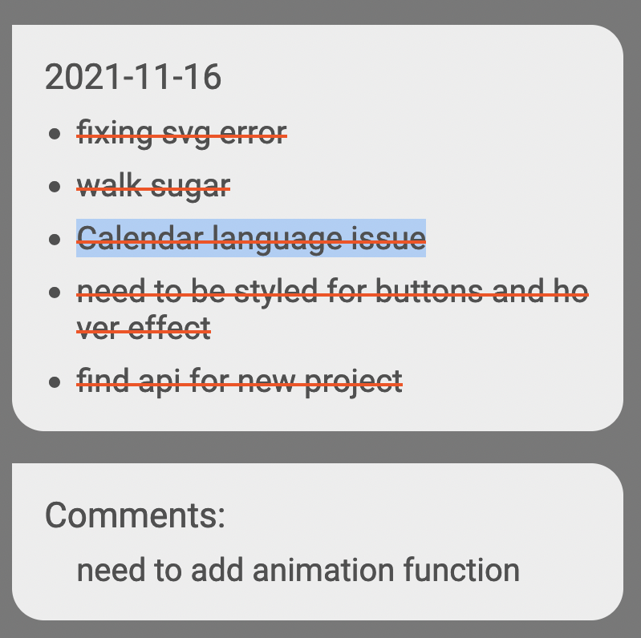

# Daily Log

Here is the link for the live page! [Live Page](https://seungmin-shin-project-3.netlify.app/).

## Languages

Built by using HTML, CSS, React, and Firebase.

## Description

This is a CRUD application where users can utilize it to record their daily activities, save them for future references, and delete them if needed.

Those red dots are represented for the user's previous activities. 

When a user clicks a date with a red dot, they can see their activities for that specific date and check what was completed or not and comments.

